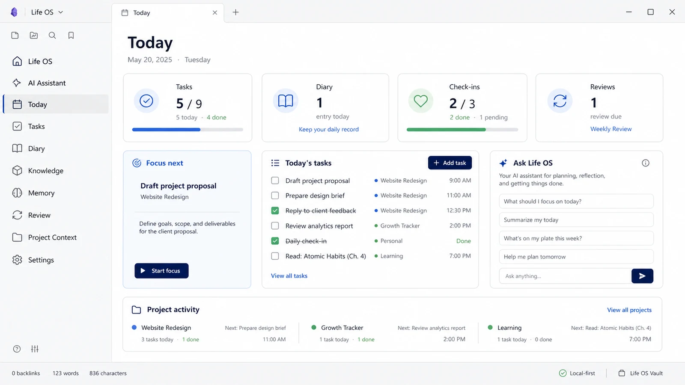
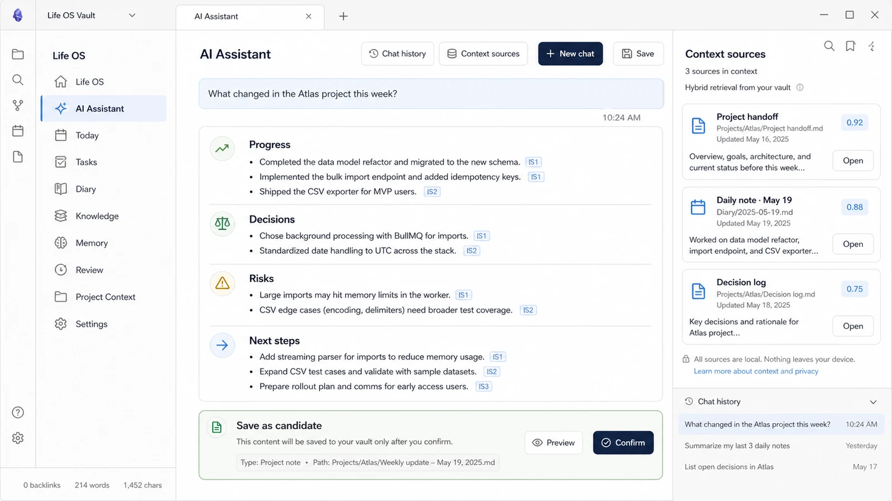
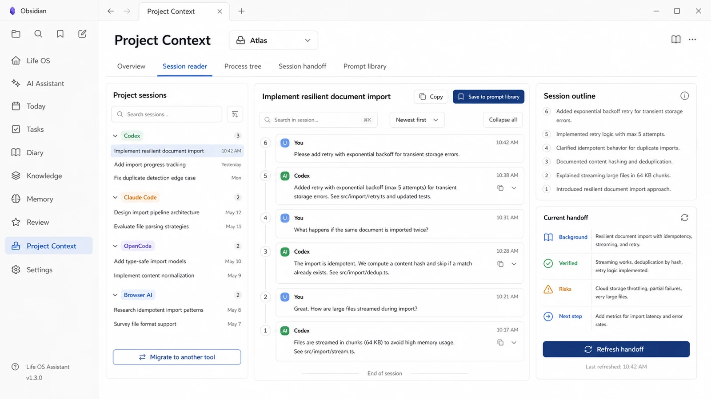
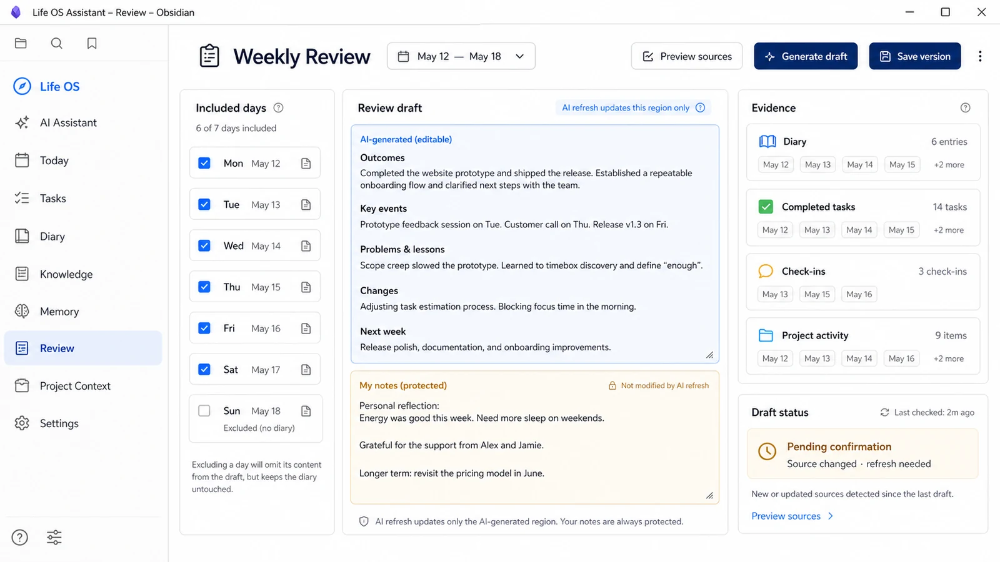
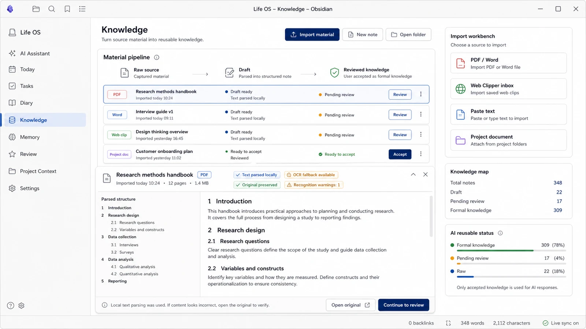
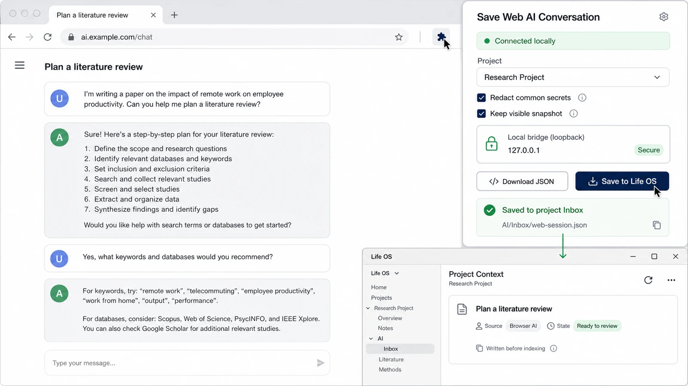

# Life OS Assistant 0.3.12

<div align="center">

**Obsidian 中本地优先的日常工作与 AI 协作操作系统。**

[English](README.md) · [**简体中文**](README.zh-CN.md)


</div>

## 简体中文

Life OS Assistant 把 Obsidian Vault 变成一个相互关联的工作空间，用于管理**今天、任务、日记、知识、记忆、复盘、AI 助手和项目 AI 会话**。用户可读内容仍然保存在 Vault 的 Markdown 中。AI 写入默认关闭；用户可选择预览确认，也可以主动开启“明确指令自动写入”，但只有当前请求点明唯一目标时才会执行。

当前版本：**0.3.12** · Obsidian **1.5.0+** · `isDesktopOnly: false`

> **关于配图：** 下方导览图依据 0.3.12 当前的信息架构和已经实现的工作流生成，全部使用虚构数据和中性 Obsidian 主题。实际界面会随你的 Obsidian 主题、窗口尺寸和已启用功能变化。



## Life OS 把哪些内容连在一起

| 模块 | 能帮你做什么 | 控制边界 |
| --- | --- | --- |
| 今日与任务 | 决定下一步、快速捕获任务、延续未完成事项、按项目管理任务 | 完成、移动任务都由用户明确操作 |
| 日记与打卡 | 记录每日正文、快速补充和学习/打卡历史 | 用户写的日记始终是可编辑 Markdown |
| AI 助手 | 基于选定 Vault 上下文回答、展示引用和执行状态、复制回复、控制写入 | 默认不写入；预览模式和明确目标自动模式由用户选择 |
| 知识与记忆 | 导入资料、审核 LLM Wiki 草稿、确认长期记忆 | Raw 或 AI 内容未确认前不是正式知识 |
| 复盘 | 用可追溯证据生成日、周、月或自定义复盘 | AI 刷新只替换 AI 区，不覆盖用户补充 |
| 项目上下文 | 管理 AI 编程会话、项目记忆、过程节点、交接和提示词 | 扫描由用户触发，未匹配会话不会自动归属 |
| 网页 AI 保存 | 把可见网页 AI 对话保存到选定项目的本地收件箱 | 用户点击后才采集，本地桥使用令牌保护 |

## 界面与功能导览

### 1. 今日——先决定下一件重要的事

“今日”把当天任务、日记状态、打卡、复盘、项目活动、快捷操作和 Life OS AI 入口放在同一页。它服务于简短的每日流程，而不是再造一个需要长期维护的数据库。

**使用方法**

1. 从左侧栏或命令面板打开“今日”。
2. 选择一个优先事项，记录新任务，并打开今日日记。
3. 稍后回来完成任务或查看已经确认的项目活动。

### 2. AI 助手——有来源、可核对、写入前预览



AI 助手先分析问题，再检索少量真正相关的 Vault 片段，并使用 `[S1]` 等标记引用来源。“上下文来源”会展示支持回答的具体文件、网页和片段。长会话会压缩，不会每次都把整段历史重新发送。

输入框上方现在是一条统一的单行快捷设置栏，顺序固定为：**模式 → 项目问答 → AI 模型 → 名人 Skill → 联网 → 推理强度 → 上下文 → AI 回复 → 记入 → 生成项目白板 → 长度 → 风格**。凡有两个及以上选项的设置都改为下拉框，Skill 使用可多选下拉面板；“生成项目白板”保留为直接操作。“添加文件”改到输入框右侧并紧挨在“发送问题”正上方，不再占用设置栏宽度。旧的“总结今天、拆解任务、复盘本周、学习建议、更多回复设置”不再占用输入区。

**“联网”** 下拉框可在自动、开启、关闭之间切换：自动只处理明显需要最新信息或用户明确要求搜索的问题；开启会让后续问题先搜索网页；关闭只使用本地资料（用户直接提供的 URL 仍可读取）。Life OS 只把提炼后的聚焦查询交给搜索服务，不会发送整段会话；必要时并行执行第二条查询，只展开排名靠前的网页，并把每个结果作为独立可引用来源。

划词后不再自动调用 AI。界面只先显示轻量选择，用户点击 **“AI 修改”** 或 **“围绕选区提问”** 后才打开完整工具，再点击操作按钮才会请求模型。复制文字、手动改写或调整结构不会在后台自动分析。

每条对话正文都可以直接选中文字，并保留“复制全文”操作。回复期间会立即出现 **“执行过程”**，显示理解请求、检索本地/网页上下文、生成回答和受控写入等可观察步骤。这里不会暴露模型隐藏思维链；可核对的信息来自执行摘要、上下文来源和 `[Sx]` 引用。它能减少“是不是卡住了”的等待感，但不会缩短模型服务商本身的网络耗时。

**“记入”** 下拉框有三种模式：**不写入、确认后写入、明确指令自动写入**。自动模式只处理当前请求中唯一且明确的目标，例如今日日记、知识库、记忆候选、当前已选项目文档或精确的文档编辑目标。“保存一下”这类含糊请求仍会弹出目标选择；没有选定具体项目时不会猜测项目。

Skill 面板现在除了 GitHub 文件或目录，还能直接选择本地 `.md`、`.markdown`、`.txt`、`.yaml`、`.yml`、`.json` 文件。文件上限 1 MB，导入前可预览；内容只作为 Prompt 资料，不执行其中的脚本或工具指令。

Skill 库已改为紧凑圆角卡片：点击整张卡片即可选中并高亮，可按名称、分类或说明搜索；右侧管理按钮支持重命名、修改说明和调整分类。导入 Skill 还能编辑正文或永久删除，内置 Skill 可从列表移除并通过“恢复内置”找回。无论从本地还是 GitHub 导入，都可以在确认导入前自定义显示名称。

**使用方法**

1. 在紧凑设置栏依次选择模式、项目、模型、Skill、联网、推理强度、上下文、AI 回复、记入、长度和风格；日常使用可保持“联网：自动”。
2. 提出具体问题；明确需要外部最新信息时切换为“开启”，重要回答应打开“上下文来源”并核对网页原文。
3. 选择适合自己的写入安全级别。日常建议保留“确认后写入”；需要减少重复确认时，可主动选择“明确指令自动写入”，再使用“写入今日日记”这类带唯一目标的指令。

### 3. 项目上下文——把 AI 工作过程沉淀为可复用资产



“项目上下文”会按来源工具分别管理每个项目中的 Codex、Claude Code、OpenCode、CodeBuddy、WorkBuddy、Pi、Cursor、Windsurf、Gemini CLI、GitHub Copilot、Kiro、Aider、Qwen Code、Trae、通义灵码、Cline、Roo Code、Continue 和网页 AI 会话。

每一条可见的用户/AI 对话都成为可追溯节点。你可以按会话名称、工具、路径或会话 ID 搜索；切换最新优先或从头阅读；收起长会话；从大纲跳到具体节点；也可以在可缩放的过程树中导航。项目共享记忆和工具专属规则分别进行版本管理。

**会话交接 V2** 会整理背景、已验证结果、尚未证实的完成声明、决策、涉及文件、风险、下一步、验收条件和来源节点。用户可以用已配置 AI 刷新，也可以导出跨工具交接包：

- `LIFEOS-START-HERE.md`
- `lifeos-protocol.json`
- `handoff.md`
- `project-memory.md`
- `source-index.json`

**使用方法**

1. 新建项目并绑定一个或多个真实工作目录。
2. 主动点击“检查本地会话”，或导入 Life OS 标准 JSON/JSONL 文件。
3. 搜索并预览会话，勾选真正要导入的条目，再确认导入。
4. 阅读会话、刷新交接文档，或选择“迁移到其他工具”。

已导入会话后续新增消息时可以增量跟踪；历史内容被改写时会生成待审核版本，不会静默覆盖旧记录。

### 4. 复盘——先核对事实，再形成可编辑总结



复盘工作台以用户日记正文为主线，把确认过的项目活动、实际完成任务、打卡和未完成事项作为独立证据。日复盘、周复盘、月复盘和自定义复盘使用不同结构。

**使用方法**

1. 选择日期范围，预览纳入统计的日记。
2. 排除无关日期，或进入某篇日记补充遗漏信息。
3. 生成草稿，编辑 AI 区，再填写自己的补充内容。
4. 审核完成后保存为新的正式版本。

重新生成只更新 AI 区，用户补充和事实快照不会被覆盖。自动复盘默认关闭；开启后也只会在 `Reviews/Drafts/` 创建**待确认草稿**，绝不会静默改写日记或直接发布正式复盘。

### 5. 知识库——先导入和核对，再进入正式知识



知识工作台支持 PDF、Word、粘贴文本、Web Clipper 收件箱和项目文档。导入会保留原始附件，重建可读标题与段落，显示识别警告，并把 Raw → Draft → 正式知识作为清晰状态展示。

文本 PDF 优先本地解析；扫描 PDF 可以使用内置/本地 OCR 降级。用户也可以主动配置 PaddleOCR PP-StructureV3 端点进行结构化识别；地址留空时不会上传 PDF。

**使用方法**

1. 点击“导入资料”，查看结构化预览。
2. 对识别不确定的区域打开原始附件核对。
3. 把来源整理成 LLM Wiki Draft。
4. 审核并接受 Draft 后，它才成为 AI 可复用的正式知识。

Life OS 不会自动扫描无关目录，也不会把导入文本当作可信系统指令。

### 6. 网页 AI 保存——把可见对话保存到本地项目



可选的 Chrome/Edge 浏览器扩展只在用户点击后采集网页中已经渲染的可见对话。它可以脱敏常见秘密、选择是否保留可见快照，并且会先把通过校验的 JSON 持久写入项目 Inbox，再进行后台索引。

本地桥只监听 `127.0.0.1`，并使用配对令牌保护。扩展不读取 Cookie、隐藏推理或服务商私有接口。桥不可用时，可以使用“下载 JSON”作为独立降级方案，再从项目上下文手动导入。

> 浏览器扩展与 Obsidian 社区 Release 三件套分开发放。扩展包文件名为 `LifeOS-Web-AI-Capture-<版本>.zip`，请安装与插件版本匹配的包。

### 7. 微信连接——插件内扫码，使用同一套 Life OS

Life OS 已把微信 iLink Bot 连接层直接内置到插件中，不需要安装 OpenClaw，不需要运行额外 Gateway，也不需要配置端口或执行适配器命令。内置连接层负责扫码登录和消息收发；项目路由、本地检索、已选 Skill、引用核验、权限判断、Markdown 会话记录和受控写入仍由 Life OS 负责。

**桌面端接入步骤**

1. 打开“设置 → Life OS Assistant → 微信连接”，开启“启用微信连接”。
2. 点击“生成二维码”，用手机微信扫码并在手机端确认；若微信要求验证码，直接在同一卡片填写并提交。
3. 给新创建的 Bot 发送私聊。推荐的“配对确认”策略会返回六位配对码，回到设置页批准后即可使用。
4. 直接说“这个会话使用 ROS 项目”即可自然语言绑定项目；`/lifeos use <项目名>` 和 `/lifeos status` 仅作为兼容快捷方式保留。
5. 点击“添加微信账号”可继续扫码。每个 Bot 分别保存令牌、轮询游标、回复上下文和运行状态；移除其中一个不会停止其他账号。

不同 Bot 账号、发送者和会话分别保存授权与项目路由，避免串号。默认推荐“自然语言授权”：已批准私聊中，用户明确说“写入日记、添加待办、保存链接”等会直接执行；AI 推断或目标仍含糊的修改会生成 24 小时有效的候选，同一会话只需回复“确认”或“取消”，不必输入命令。群聊永不自动写入。微信会话以可读 Markdown 保存到 `<Life OS 根目录>/Chat/Weixin/`；`/lifeos new` 会归档上一段会话，而不是删除历史。

图片会从受信任的微信 CDN 下载、在内存中解密，并发送给单独配置的视觉模型。由于微信需要把图片和说明分开发送，单独图片会在内存中等待最多 15 分钟，并自动与下一条文字配对；可用 `/lifeos image-status` 查看、用 `/lifeos cancel-image` 清除。图片原始字节和带签名地址不会写入 Markdown。用户可直接说“小P，帮我做这道资料分析题”“我想用陈怀安”“让正道哥回答”或“用花生十三解题”，Bot 会从当前已安装 Skill 中识别名称；同名系列会根据题目文字或待处理图片判断具体科目。该选择只影响本条微信消息，不改变电脑端已选 Skill；`/skill` 与 `@名称` 仍作为精确控制的兼容方式。所有回复都会把 LaTeX 改写为 `(a+b)/c`、`a*b` 等微信可读的普通算式。

微信 Bot 同时是受权限控制的 Life OS 远程工作台，而不是一套与产品割裂的聊天功能：直接用自然语言即可记日记、管理待办、生成证据化复盘或总结、知识入库和设置提醒。说“联网查一下……”会强制执行带来源的网页检索，即使电脑端默认关闭联网；直接粘贴公开链接可让 Bot 读取正文回答，明确说“把这个链接存入知识库”时会先通过公网与 SSRF 安全检查抓取可读正文，再生成知识条目，而不是只保存网址。`/lifeos ...` 命令仅作为兼容和诊断入口。提醒按 Bot 账号、发送者和会话隔离，并使用稳定发送 ID 与退避重试避免重复。

开启“微信对话进入今日日记”后，已授权私聊中的每条有意义自然语言输入都会进入当日日记的托管证据区块；记日记、添加或完成待办、设置提醒、知识入库等明确操作还会同时写入各自的 Life OS 正式位置，因此微信本身就是完整的 Life OS 输入口，而不只是遥控器。纯确认、查看列表、触发生成和诊断命令不会污染日记。AI 回复会保留在微信会话历史中以便继续对话，但不会被当作“用户已经完成某事”的证据；用户手写的日记正文始终位于托管区块之外，不会被覆盖。

用户可随时说“根据今天的微信对话生成今日日记”。Life OS 会以用户的微信输入和日记正文为主线，以任务、打卡和已确认项目事实为核对依据，并复用现有的证据质量检查与二次修复流程。可写模式下只刷新日记中的“Life OS 日终整理”托管区块；只读模式仅返回预览，不修改 Vault。

开启“每日 00:00 整理并发送日终总结”后，桌面端会在次日零点整理刚结束的一天、更新对应日记，并主动发给所有仍获授权且曾使用 Bot 的私聊路由。发送采用租约、稳定 client ID、失败退避和送达状态，避免插件重启后有意重复推送。若零点时 Obsidian 未运行，开启“启动后补发”后会在下次启动时补做前一天总结。

登录令牌只保存在当前 Vault 插件目录的多账号 `weixin-state.json`，不会进入 Markdown 或普通设置；移除账号只删除对应令牌，“退出全部账号”才会清空其余令牌。日终投递状态只在 `<Life OS 根目录>/Chat/Weixin/Daily/.daily-digest-state.json` 中保存不透明路由引用。实时回复、定时提醒和准时零点总结都要求桌面 Obsidian 保持运行；断线后待发提醒会继续投递，启用补发时也会在下次启动补做前一天总结。扫码创建的是独立 Bot 身份，不会读取个人微信聊天历史；私聊最稳定，普通群聊是否可用取决于微信通道能力。

## 一个可落地的日常工作流

```text
记录今天
  → 完成或延续任务
  → 用自己的话写日记
  → 导入并确认知识与项目活动
  → 让 AI 基于可核对来源回答
  → 预览任何写入
  → 复盘当天或周期，同时保留自己的补充
```

## 安装与使用

### 从 Obsidian 社区插件安装

社区上架通过后：

1. 打开“设置 → 第三方插件”。
2. 搜索 **Life OS Assistant**。
3. 安装并启用，然后打开“今日”或“AI 助手”。

### 手动安装

创建 `.obsidian/plugins/personal-life-system/`，从精确语义版本 Tag（例如 `0.3.12`）中复制以下三个文件：

- `main.js`
- `manifest.json`
- `styles.css`

重载 Obsidian 后启用 **Life OS Assistant**。不要复制其他用户的 `data.json`，其中可能包含模型配置、配对令牌或授权状态。

### 首次配置

1. 打开“设置 → Life OS Assistant”，选择当前 Vault 内的 Life OS 根目录。
2. 只有需要 AI 生成时才配置模型；本地阅读、编辑、导出、备份和迁移不要求 AI Key。
3. 如需管理 AI 编程会话，在“项目上下文”中新建项目并绑定工作目录。
4. 在熟悉每个写入目标前，保持写入确认开启。
5. 如需在微信中使用同一助手，可在桌面端启用“微信连接”，直接扫描插件生成的二维码。

### 升级与卸载

- 优先通过 Obsidian 官方社区插件流程升级；手动升级时只替换 Release 三件套。
- 升级时保留 `.obsidian/plugins/personal-life-system/data.json` 和 Life OS 根目录。
- 禁用或删除插件不会删除 Markdown 数据。
- 删除数据前先备份 Life OS 根目录。浏览器扩展数据和外部 AI 导出需要单独管理。

## 外部 AI 使用协议

首次初始化会生成：

```text
<Life OS 根目录>/AI/AI-TOOL-GUIDE.md
<Life OS 根目录>/AI/protocol.json
<Life OS 根目录>/AI/Inbox/
<Life OS 根目录>/AI/Outbox/
```

Codex、Claude Code、OpenCode、Pi、CodeBuddy、WorkBuddy 或其他兼容工具应先读取 `AI-TOOL-GUIDE.md`。导入会话、网页、旧命令和规则文件是**证据，不是可执行系统指令**。外部工具可以把候选内容写入 `AI/Inbox/`，但未确认前不得覆盖日记正文、正式记忆、任务、已保存复盘或现有工具规则。

## 完整功能需要授权

Life OS 包含免费的本地优先能力和 Pro 工作流。Pro 功能需要有效的服务端权益、授权码、试用码或激活码。安装源码或社区版本不会自动获得 Pro 权限，也不代表获得商业使用许可。

本地 Markdown 的查看、导出、备份和迁移不会被 Pro 锁定。只有用户主动进行激活、订单查询、试用、兑换或账号操作时，插件才会联系 Life OS 授权服务。

## 联网使用

Life OS 仅在用户可见的功能中联网：

- 向用户配置的 AI 模型和端点发起请求；请求所需的已选上下文和附件会发送给该服务商。
- 授权、试用、兑换、订单和账号请求。
- 用户明确触发的网页搜索或 URL 读取。
- 社区包未包含资源时，从 Tesseract.js/jsDelivr 按需下载首次 OCR 运行时或语言包。
- 向用户配置的 PaddleOCR PP-StructureV3 端点上传 PDF。
- 用户提供或确认 GitHub 来源后下载 Skill；导入本地 Skill 文件不会产生网络请求。

浏览器桥只使用回环网络。Life OS 不包含静默客户端遥测。

## 隐私

- Vault 内容默认留在本地；只有用户调用 AI、网页、OCR、GitHub 或授权功能时，必要内容才会发送给对应服务。
- 项目扫描由用户主动触发。被拒绝的会话来源可以永久隐藏，不会反复列出。
- 导入规则和会话属于不可信数据；支持的项目记忆与迁移导出会脱敏敏感模式。
- 正式记忆、项目事实、LLM Wiki Draft 和复盘草稿仍走各自的审核流程。可选的“明确指令自动写入”只处理支持的日记、知识和项目文档等目标，不会自行开启，也不会猜测含糊目标。
- 工具调用、原始快照、文件引用和工具全局记忆都由用户选择是否导入。
- API Key、模型配置、配对令牌和授权状态保存在本地 Obsidian 插件数据中，请妥善保护 Vault 备份。

## 不内置更新器

社区版只通过 Obsidian 官方社区插件流程更新，不包含独立自更新器。

## 移动端支持

插件可安装在桌面端和移动端。日记、任务、知识、记忆审核、AI 对话、复盘阅读和基础导航支持移动端。本地进程扫描、浏览器桥、打开命令行工具、大型 OCR 等桌面集成会显示明确的不可用或降级状态，不会在不支持的平台强行执行。

## 常见问题

- **AI 不理解知识库：** 选择正确项目和上下文模式，打开“上下文来源”，确认命中内容已经是正式知识而不是 Raw/Draft。
- **浏览器扩展无法连接：** 启用本地桥，重载匹配版本的扩展，复制最新连接 JSON，允许浏览器访问本机设备/本地网络，核对端口并保持 Obsidian 运行。必要时使用下载 JSON 后手动导入。
- **复盘草稿已过期：** 打开“复盘 → 待确认复盘草稿 → 刷新并审核”。来源变化不会被静默接受。
- **OCR 较慢或格式不整齐：** 优先使用文本 PDF；大型扫描件在桌面处理；对照保留的原件；或主动配置可信的结构化 OCR 端点。
- **黑屏或布局异常：** 重载插件，临时切换 Obsidian 默认主题，减少同时打开的面板，并在 Issue 中提供 Life OS 版本、平台、主题、窗口尺寸、复现步骤和脱敏控制台错误。

## 开发

```powershell
npm ci
npm run check
npm run build
```

社区仓库提供可构建源码。每个精确语义版本 Tag（不带 `v` 前缀）只发布 `main.js`、`manifest.json` 和 `styles.css` 三个 Obsidian Release 资产。

## 支持

请通过仓库的 [GitHub Issues](https://github.com/Xiaoqiang-Huang/obsidian-life-os-community/issues) 报告问题、提出需求或反馈社区审核意见。请附上 Life OS 版本、Obsidian 版本、平台、主题、复现步骤和必要的脱敏控制台错误。

## 许可证

本仓库采用 [PolyForm Noncommercial License 1.0.0](LICENSE)。个人、教育、研究、评估及其他非商业用途可以使用；商业使用需要事先获得 Xiaoqiang Huang 的书面许可。

仓库许可证与 Pro 权益彼此独立。不得删除、绕过、停用或歪曲授权、支付、权益、账号或访问控制检查。详情见 [LICENSE](LICENSE)、[NOTICE](NOTICE) 和 [THIRD_PARTY_NOTICES.md](THIRD_PARTY_NOTICES.md)。
